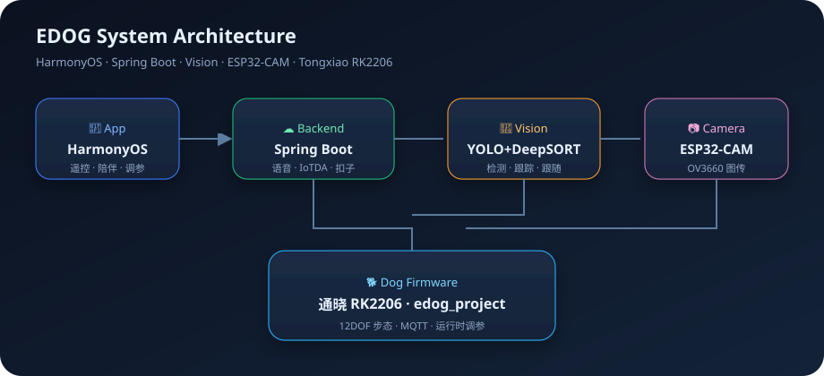
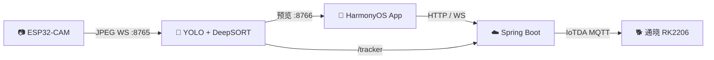

<div align="center">

# 🐕 EDOG powered by RK2206

**软通动力通晓开发板（RK2206）** · OpenHarmony LiteOS · HarmonyOS · 视觉跟随

[](https://github.com/yangzhiyong3508/Edog_powered_by_rk2206)
[](https://github.com/yangzhiyong3508/edog_project_docker)
[](https://github.com/yangzhiyong3508/Edog_powered_by_rk2206)

<p>
  <a href="https://github.com/yangzhiyong3508/Application"></a>
  <a href="https://github.com/yangzhiyong3508/SpringBoot"></a>
  <a href="https://github.com/yangzhiyong3508/DeepLearning"></a>
  <a href="https://github.com/yangzhiyong3508/ESP32"></a>
  <a href="https://github.com/yangzhiyong3508/edog_project_docker"></a>
</p>



</div>

---

## ✨ 这是什么？

EDOG 是一套可落地的 **智能四足机器人全栈方案**：手机遥控与陪伴、云端语音与大模型、视觉目标跟随、机载 12 自由度步态控制，贯穿「看见 → 决策 → 运动」闭环。

| 能力 | 一句话 |
|------|--------|
| 🎮 遥控 | App 九宫格 / 手柄，经后端下发 IoTDA 命令 |
| 🗣️ 语音 | 唤醒词、ASR/TTS、扣子 Agent 对话 |
| 👀 跟随 | CAM 图传 + YOLO/DeepSORT，自动跟目标 |
| 🦵 步态 | 通晓 RK2206 上 12DOF trot/转向/有限步 |
| 🔧 调参 | 俯仰、步长步高、速度、舵机中位校准 |

---

## 🧩 仓库地图（Git Submodule）

| 目录 | 仓库 | 角色 |
|:----:|------|------|
| 📱 `Application/` | [Application](https://github.com/yangzhiyong3508/Application) | HarmonyOS 手机端 |
| ☁️ `SpringBoot/` | [SpringBoot](https://github.com/yangzhiyong3508/SpringBoot) | 语音 · IoTDA · 扣子 · 调试台 |
| 🧠 `DeepLearning/` | [DeepLearning](https://github.com/yangzhiyong3508/DeepLearning) | 检测跟踪与图传转发 |
| 📷 `ESP32/` | [ESP32](https://github.com/yangzhiyong3508/ESP32) | ESP32-CAM 推流 |
| 🐕 `Docker_Edog/` | [edog_project_docker](https://github.com/yangzhiyong3508/edog_project_docker) | 狗端固件源码 |



---

## 🚀 快速开始

```bash
# 一次拉齐全部子模块
git clone --recurse-submodules https://github.com/yangzhiyong3508/Edog_powered_by_rk2206.git
cd Edog_powered_by_rk2206

# 若已克隆但子模块是空的
git submodule update --init --recursive
```

各端详细步骤见对应目录下的 `README.md` 👇

| 端 | 文档 |
|----|------|
| App | [`Application/README.md`](https://github.com/yangzhiyong3508/Application#readme) |
| 后端 | [`SpringBoot/README.md`](https://github.com/yangzhiyong3508/SpringBoot#readme) |
| 视觉 | [`DeepLearning/README.md`](https://github.com/yangzhiyong3508/DeepLearning#readme) |
| 图传 | [`ESP32/README.md`](https://github.com/yangzhiyong3508/ESP32#readme) |
| 固件 | [`Docker_Edog/README.md`](https://github.com/yangzhiyong3508/edog_project_docker#readme) |

### 更新子模块到最新

```bash
git submodule update --remote --merge
git add Application SpringBoot DeepLearning ESP32 Docker_Edog
git commit -m "chore: bump submodules"
git push origin main
```

---

## ⚙️ 配置模板

- 后端：`SpringBoot/config/application-secrets.example.yaml`
- 固件：`Docker_Edog/include/edog_config.local.example.h`
- 视觉权重说明：`DeepLearning/weights/README.md`

---

## 🌿 分支说明

| 分支 | 含义 |
|------|------|
| `main` | 当前 monorepo + submodule 架构 |
| `archive/old-main` | 历史主分支归档 |

---

<div align="center">

**EDOG** · 通晓 RK2206 · 从感知到运动的完整链路

</div>
